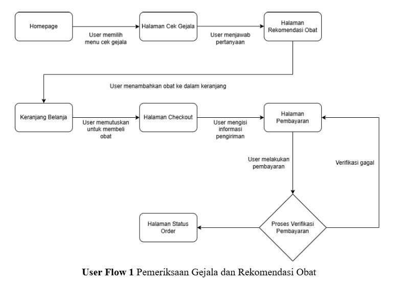
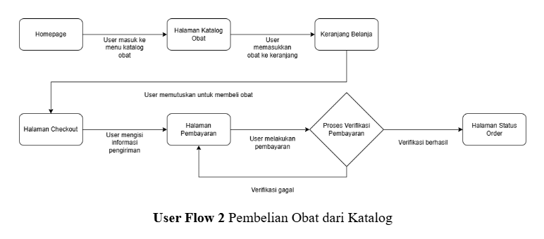
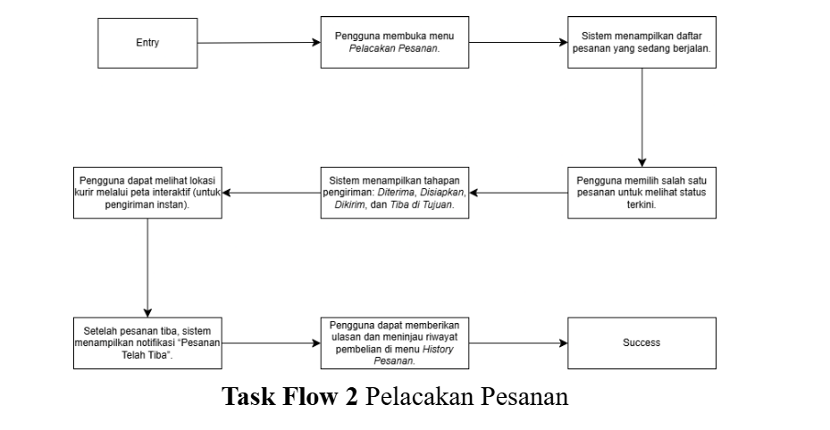
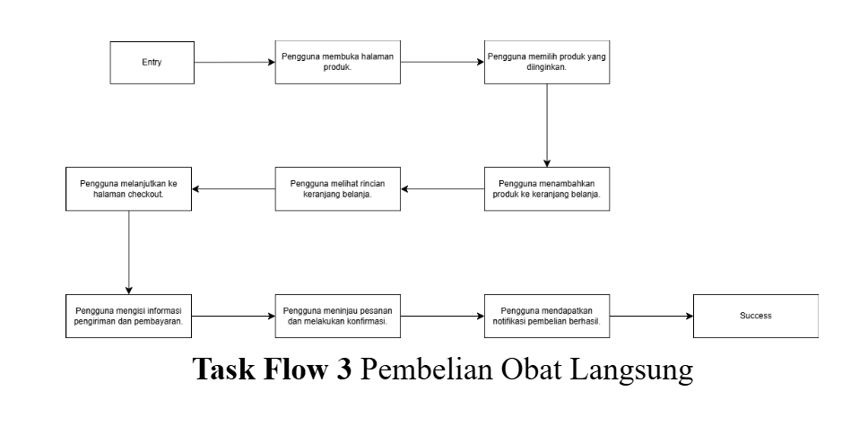

# Farmago - Digital Health & Online Pharmacy Assistant

Farmago adalah aplikasi kesehatan digital yang menggabungkan pemeriksaan gejala, rekomendasi obat, dan layanan pembelian obat online dalam satu platform terintegrasi. Aplikasi ini dirancang untuk membantu pengguna melakukan penanganan awal kondisi kesehatan ringan secara aman, informatif, dan efisien.

---

## ⭐ Fitur Utama

### 1. Pemeriksaan Gejala

Pengguna menjawab pertanyaan sederhana tentang keluhan, lalu sistem menampilkan ringkasan gejala sebagai triase awal sebelum masuk ke rekomendasi obat.

### 2. Rekomendasi Obat

Menampilkan obat yang sesuai dengan gejala lengkap dengan dosis, komposisi, indikasi, dan peringatan. Disertai catatan bahwa ini hanyalah panduan awal dan bukan diagnosis medis.

### 3. Katalog Obat & Pencarian

Pengguna dapat mencari obat melalui kolom pencarian serta filter kategori/harga. Fitur ini dirancang ringan dan responsif.

### 4. Keranjang & Checkout

Pengguna dapat menambah/menghapus produk, mengatur alamat, dan memilih metode pembayaran. Proses checkout terdiri dari tiga langkah:  
**Pilih produk → Pilih pembayaran → Konfirmasi pesanan.**

### 5. Pelacakan Pesanan Real-Time

Status pesanan ditampilkan dalam empat tahap:  
**Diterima → Disiapkan → Dikirim → Tiba**  
Untuk pengiriman instan tersedia pelacakan kurir melalui peta.

### 6. Riwayat Pesanan

Menyimpan seluruh pembelian sebelumnya sehingga pengguna dapat melakukan pembelian ulang dengan cepat dan memantau histori penggunaan obat.

---

## FLOW

Berikut adalah alur pengguna (User Flow) dari aplikasi kami:
### Bagian 1

### Bagian 2

Berikut adalah alur kerja (Task Flow) dari aplikasi kami:
### Bagian 1

### Bagian 2

### Bagian 3

---
## 👥 Kelompok 7 - Adudu

| NIM       | Nama                  |
| --------- | --------------------- |
| 122140018 | Freddy Harahap        |
| 122140058 | Muhammad Kaisar Teddy |
| 122140125 | A Kevin Sergian       |
| 122140144 | Dwi Arthur Revangga   |
| 122450005 | Asa Do'a Uyi          |

---

**Dosen Pengampu:** Amirul Iqbal, S.Kom., M.Eng  
**Asisten:** Muhammad Fauzi Azizi (122140106)
